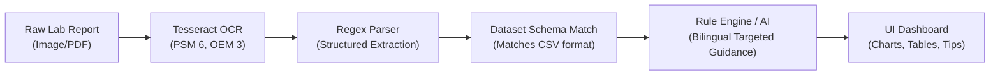

# Kaggle Dataset Card: Medical Lab Reports & Biomarker Diagnostics Dataset

## Dataset Title
**Bilingual Clinical Lab Biomarkers & Patient Lifestyle Advisory Dataset**  
*A benchmark dataset for automated lab report analysis, reference-range classification, and targeted lifestyle recommendations.*

---

## 1. Dataset Overview

| Attribute | Specification |
| :--- | :--- |
| **Filename** | `kaggle_medical_lab_dataset.csv` |
| **Format** | Standard CSV (Comma Separated Values), UTF-8 Encoded |
| **Domain** | Healthcare Informatics, Clinical Pathology, Medical AI |
| **Languages** | English + Tamil (Bilingual) |
| **Target Application** | OCR extraction benchmarking, clinical range classification, personalized wellness guidance |
| **License** | Open Database License (ODbL) / Academic Research Use |

---

## 2. Clinical Categories Covered

The dataset covers **7 key diagnostic domains** commonly tested in clinical pathology laboratories:

1. **Complete Blood Count (CBC)**: Hemoglobin, RBC Count, Platelets, WBC Count
2. **Diabetes & Glycemic Profile**: Fasting Blood Sugar (FBS), HbA1c (Glycated Hemoglobin)
3. **Lipid Profile (Cardiovascular)**: Total Cholesterol, Triglycerides, HDL Cholesterol, LDL Cholesterol
4. **Renal / Kidney Function (KFT/RFT)**: Serum Creatinine, Blood Urea, Serum Uric Acid
5. **Hepatic / Liver Function (LFT)**: SGPT (ALT), SGOT (AST), Alkaline Phosphatase, Total Bilirubin
6. **Endocrine / Thyroid Profile**: Thyroid Stimulating Hormone (TSH), Total T3, Total T4
7. **Nutritional Biomarkers**: Serum Ferritin, Vitamin D (25-OH), Vitamin B12

---

## 3. Dataset Features (Columns Description)

| Column Name | Data Type | Description | Example |
| :--- | :--- | :--- | :--- |
| `Patient_ID` | String | Anonymized unique patient identifier | `PID-1001` |
| `Age` | Integer | Patient age in years | `52` |
| `Gender` | String | Patient biological gender (`Male` / `Female`) | `Male` |
| `Test_Category` | String | Diagnostic laboratory department | `Diabetes / Glycemic` |
| `Test_Name` | String | Specific clinical parameter name | `Fasting Blood Sugar` |
| `Test_Value` | Float | Measured lab quantitative value | `158.0` |
| `Unit` | String | Standard clinical measurement unit | `mg/dL` |
| `Reference_Range` | String | Standard laboratory reference threshold | `70.0 - 99.0` |
| `Status` | String | Deterministic status (`Normal`, `High`, `Low`) | `High` |
| `Clinical_Risk_Level` | String | Categorical risk rating (`Normal`, `Mild Risk`, `Moderate Risk`, `High Risk`) | `Moderate Risk` |
| `Targeted_Diet_Lifestyle_EN` | String | Parameter-specific nutritional & lifestyle guidance (English) | *Millets, oats; avoid refined sugars* |
| `Targeted_Diet_Lifestyle_TA` | String | Parameter-specific nutritional & lifestyle guidance (Tamil) | *சிறுதானியங்கள், ஓட்ஸ்; சர்க்கரை தவிர்க்கவும்* |
| `Preventive_Care_Recommendation_EN` | String | Follow-up diagnostic and self-care monitoring steps (English) | *Quarterly HbA1c, weekly fasting sugar* |
| `Preventive_Care_Recommendation_TA` | String | Follow-up diagnostic and self-care monitoring steps (Tamil) | *3 மாதங்களுக்கு ஒருமுறை HbA1c பரிசோதனை* |

---

## 4. Patient Case Scenarios in Dataset

| Patient ID | Age / Gender | Primary Finding | Clinical Classification |
| :--- | :--- | :--- | :--- |
| **PID-1001** | 52, Male | Uncontrolled Diabetes & Dyslipidemia | High FBS, Elevated HbA1c, High Total Cholesterol, Low HDL |
| **PID-1002** | 28, Female | Microcytic Anemia (Iron Deficiency) | Low Hemoglobin, Low RBC, Low Serum Ferritin |
| **PID-1003** | 61, Male | Renal Impairment / Early CKD Strain | High Serum Creatinine, High Blood Urea, High Uric Acid |
| **PID-1004** | 35, Female | Primary Hypothyroidism | Elevated TSH, Borderline High Cholesterol |
| **PID-1005** | 44, Male | Hepatic Inflammation / Non-Alcoholic Fatty Liver | Elevated SGPT (ALT) and SGOT (AST) |
| **PID-1006** | 24, Male | Micronutrient & Vitamin Deficiency | Low Vitamin D (25-OH), Low Vitamin B12 |
| **PID-1007** | 32, Female | Healthy Adult Baseline | All parameters within physiological normal range |

---

## 5. Usage in Project Pipeline

1. **Validation Benchmark**: The CSV records serve as ground-truth test cases to evaluate OCR precision and reference-range classification accuracy.
2. **Advisory Mapping**: Directly maps abnormal parameters to targeted, non-generic dietary and self-care education in both English and Tamil.
3. **Reproducibility**: Easily imported into Python via `pandas.read_csv('kaggle_medical_lab_dataset.csv')` or visualized in Excel/Google Sheets.

---

*MedReport AI Academic Submission — Dataset Documentation*
